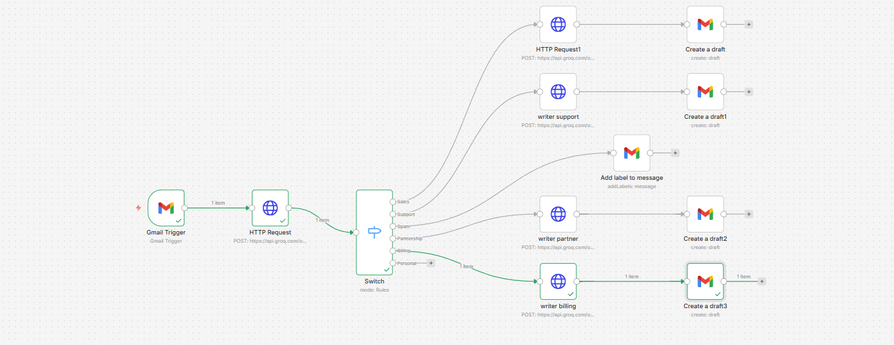

# AI Email Orchestrator 

A smart workflow that organizes my inbox and drafts replies using **n8n** and **Llama 3.3**.

## Why I Built This
I wanted to see if I could automate the "boring" parts of email (sorting, tagging, standard replies) without handing over complete control to an AI. Standard email filters are too rigid—they rely on keywords. I needed something that actually *understands* the intent of a message, whether it's a potential client, a billing issue, or just spam.

This project is my solution: an intelligent agent that reads incoming emails, decides what they are, and drafts a context-aware response for me to review.

## How It Works
The system follows a "Human-in-the-Loop" architecture. It doesn't send emails automatically; it prepares drafts so I stay in control.

1.  **Trigger:** Watches for new emails in my Gmail inbox.
2.  **The Brain (Classifier):** Sends the email content to **Llama 3.3 (via Groq)** with a specific prompt to classify the intent into one of 6 categories:
    * Sales
    * Support
    * Partnership
    * Billing
    * Spam
    * Personal
3.  **Routing (The Switch):** Based on the intent, the workflow splits into different paths.
4.  **Action:**
    * **Business Emails:** A specialized "Writer AI" drafts a relevant reply (e.g., asking for a meeting for Sales, or logging a ticket for Support) and saves it to my **Drafts** folder.
    * **Spam:** Automatically labeled/trashed.
    * **Personal:** The workflow intentionally stops. This is a safety feature to ensure the AI never tries to reply to friends or family.

## Safety & Guardrails
One of my biggest priorities was making sure the AI didn't hallucinate or reply inappropriately.
* **The "Grandma Rule":** I built a strict "Personal" branch that disconnects the AI immediately if the email is detected as personal.
* **Draft Mode:** The system uses the `Gmail Draft` operation, not `Send`. This creates a layer of safety where I can review the AI's output before it goes live.
* **Spam Trap:** Instead of replying to spam (which verifies the email address to spammers), the agent silently moves it to the trash.

## Tech Stack
* **Workflow Automation:** n8n (Cloud)
* **LLM Inference:** Groq API (Running Llama 3.3-70b-versatile for speed)
* **Integrations:** Gmail API
* **Data Handling:** JSON & JavaScript for node mapping

## Getting Started
If you want to try this yourself:

1.  Clone this repo.
2.  Import `workflow.json` into your n8n instance.
3.  Set up your credentials for **Gmail (OAuth2)** and **Groq**.
4.  Activate the workflow!

## What's Next?
I'm planning to add a RAG (Retrieval-Augmented Generation) layer so the AI can check my calendar before suggesting meeting times in the Sales drafts.
